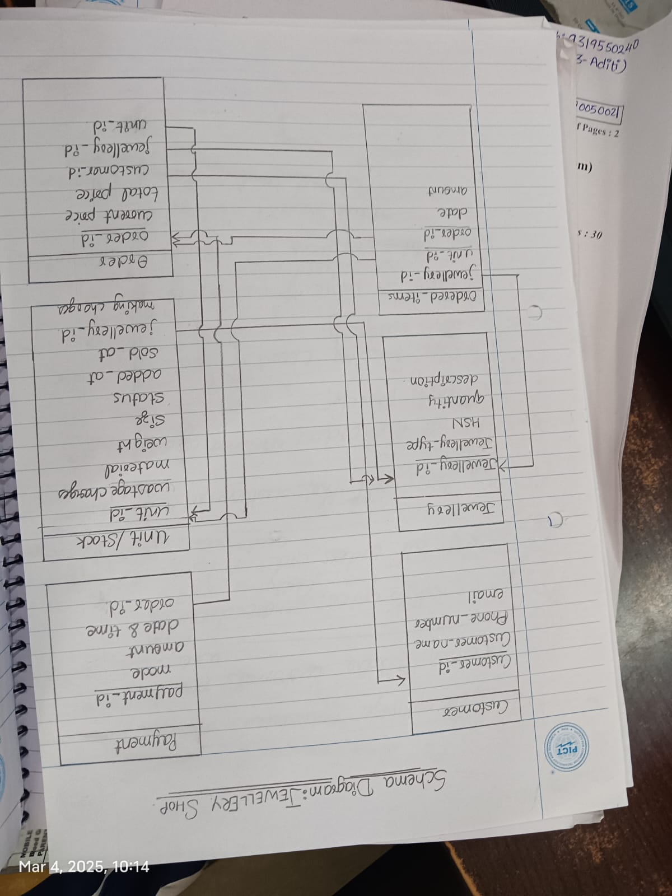
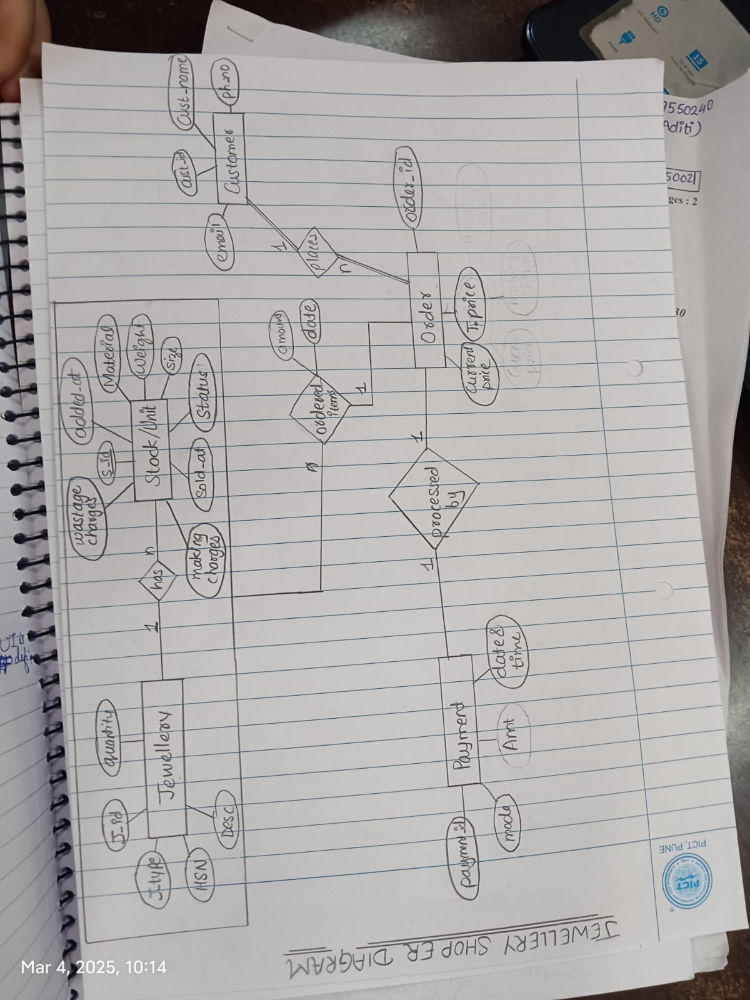

DBMS_GROUP1

PROBLEM STATEMENT: JEWELLERY SHOP MANAGEMENT SYSTEM

A jewellery business wants to develop a database system to manage its inventory, customer transactions, and order processing efficiently. The system should store details of jewellery items, including their type, description, and stock information such as material, weight, and size. Customers can place orders for jewellery, and each order should include pricing details, such as the current price, making charges, and wastage charges. The system should also record customer information, including their name, contact details, and purchase history. Customers can make payments through different modes, and each transaction should be logged with the amount, date, and time. The database should ensure proper linkage between orders, payments, and customers while maintaining accurate stock levels. The goal is to streamline operations and manage inventory effectively.

DATABASE SCHEMA:

DATABASE ER:

